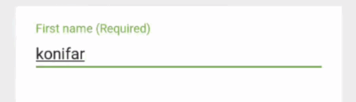
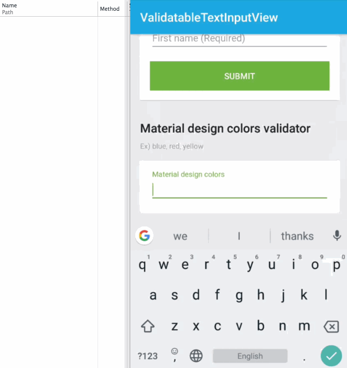

# ValidatableTextInputLayout

[](https://circleci.com/gh/Kyash/validatable-textinput-layout/tree/master)
[](https://jitpack.io/#Kyash/validatable-textinput-layout)

ValidatableTextInputLayout is the view which extended TextInputLayout to validate the input text easily.

## Download

### Project build.gradle

```groovy
allprojects {
    repositories {
        ...
        maven { url "https://jitpack.io" }
    }
}
```

### App build.gradle

```groovy
dependencies {
    ...
    compile 'com.github.Kyash:validatable-textinput-layout:LATEST_VERSION'
}
```

`LATEST_VERSION` is  [](https://jitpack.io/#Kyash/validatable-textinput-layout)

## Basic usage
You can use as same as `TextInputLayout` in layout xml.

### Layout
`trigger` attribute defines the timing of the text field validation. 

```xml
<co.kyash.vtl.ValidatableTextInputLayout
  id="@id/first_name"
  android:layout_width="match_parent"
  android:layout_height="wrap_content"
  app:trigger="text_changed">

  <EditText
    android:layout_width="match_parent"
    android:layout_height="wrap_content"
    android:hint="@string/first_name"
    android:inputType="textPersonName" />

</co.kyash.vtl.ValidatableTextInputLayout>
```

### Kotlin
Register Validator class to `ValidatableTextInputLayout`
For example, `RequiredValidator` shows error when the field is empty.

```kotlin
private fun initValidator() {
  binding.firstName.register(RequiredValidator(getString(R.string.validation_error_required)))
}
```

That's it. It works as below.



## Triggers
There are 2 types of the validation trigger attributes.

Attribute | Description
:--: | :--
text_changed | Validate immediately when the text is changed.
focus_changed | Validate when the focus is changed

## Validators
This library provides some common validators
 
Validator | Description
:--: | :--:
RequiredValidator | 
EmailValidator | 
NumberOnlyValidator | Number only
AsciiOnlyValidator | 
HiraganaOnlyValidator | Jananese Hieragana character
KatakanaOnlyValidator | Japanese Katakana character


## Custom validator
You can create the custom validator by using `VtlValidator`.
Since `VtlValidator` uses RxJava2, it can handle async logic like API as well!

[MaterialDesignColorsValidator](https://github.com/Kyash/validatable-textinput-layout/blob/master/example/src/main/java/co/kyash/vtl/example/validators/MaterialDesignColorsValidator.kt) is example to get data via API and validate the input value.

```kotlin
class MaterialDesignColorsValidator(
        private val api: MaterialDesignColorsApi,
        private val context: Context
) : VtlValidator {

    override fun validateAsCompletable(context: Context, text: String?): Completable {
        return api.all()
                .onErrorResumeNext { Single.error(VtlValidationFailureException(context.getString(R.string.validation_error_server))) }
                .flatMapCompletable { list ->
                    if (text?.trim() != null) {
                        list.filter { it == text.trim().toLowerCase() }
                                .forEach { return@flatMapCompletable Completable.complete() }
                    }
                    return@flatMapCompletable Completable.error(VtlValidationFailureException(getErrorMessage()))
                }
    }

    override fun validate(text: String?): Boolean {
        throw UnsupportedOperationException("Sync method is not arrowed because this validation uses async API response.")
    }

    override fun getErrorMessage(): String {
        return context.getString(R.string.validation_error_colors)
    }
}
```



## Contributing
We are always welcome your contribution!
If you find a bug or want to add new feature, please raise issue.

## License

```
Copyright 2018 Kyash

Licensed under the Apache License, Version 2.0 (the "License");
you may not use this file except in compliance with the License.
You may obtain a copy of the License at

    http://www.apache.org/licenses/LICENSE-2.0

Unless required by applicable law or agreed to in writing, software
distributed under the License is distributed on an "AS IS" BASIS,
WITHOUT WARRANTIES OR CONDITIONS OF ANY KIND, either express or implied.
See the License for the specific language governing permissions and
limitations under the License.
```
